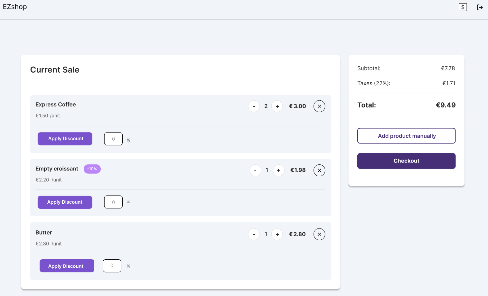

# EZShop

## Description
A comprehensive retail management application developed for the **Software Engineering I** course during my Master's Degree in Computer Engineering at **Politecnico di Torino**. EZShop is a desktop application designed to streamline the daily operations of small to medium-sized retail shops. The project encompasses the complete Software Development Lifecycle (SDLC), from rigorous requirements engineering and UML modeling to architectural design and implementation, covering Point of Sale (POS) operations, inventory tracking, supply chain management, and automated accounting.

## Core Competencies & Software Engineering Practices

* **Requirements Engineering:** Elicitation and formalization of Functional (FR) and Non-Functional Requirements (NFR), defining precise scenarios, exceptions, and system constraints.
* **UML Modeling & System Design:** Design of Context Diagrams, Use Case Diagrams, and Hardware/Software Architecture blueprints to map interactions between actors, hardware peripherals, and external APIs.
* **Role-Based Access Control (RBAC):** Implementation of a rigid permission matrix isolating functionalities across specific user roles (Shop Owner, Cashier, Logistic Operator, Accountant).
* **Workflow Automation:** End-to-end management of sale transactions, inventory depletion, automated reordering triggers, and dynamic `.csv` data importing.
* **Hardware & External API Integration:** Architectural design for interfacing with physical peripherals (barcode scanners, receipt printers) and payment gateways (Cashmatic Selfpay APIs, myPOS APIs).
* **Project Management & VCS:** Organized collaborative development using automated estimation and strict **Git Flow** branching strategies to manage feature releases and system stability.

## Technologies & Methodologies

* **Domain:** Software Engineering, ERP / POS Systems
* **Methodologies:** SDLC, Requirements Analysis, Git Flow
* **Modeling:** UML (Use Cases, Context Diagrams, System Architecture)
* **Integration Points:** REST APIs, Hardware Peripheral Interfaces