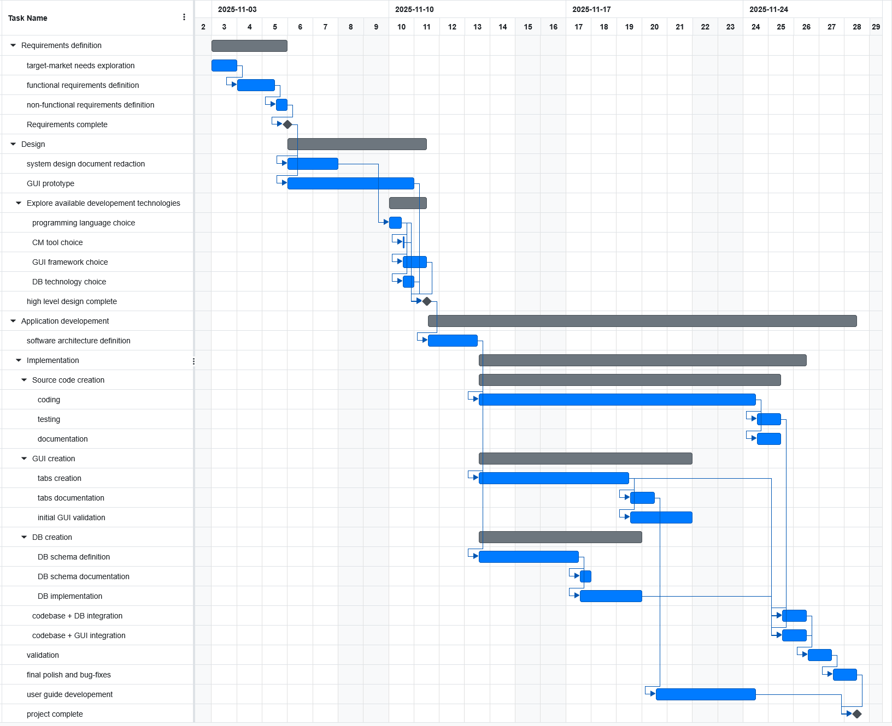

# Project Estimation

Date:

Version:

# Estimation approach

Consider the EZShop project as described in your requirements document, assume that you are going to develop the project INDEPENDENT of the deadlines of the course, and from scratch

# Estimate by size

###

|                                                                                                         | Estimate |
| ------------------------------------------------------------------------------------------------------- | ------- |
| NC = Estimated number of classes to be developed                                                        |       30 |
| A = Estimated average size per class, in LOC                                                            |       70 |
| S = Estimated size of project, in LOC (= NC \* A)                                                       |     2100 |
| E = Estimated effort, in person hours (here use productivity 10 LOC per person hour)                    |      210 |
| C = Estimated cost, in euro (here use 1 person hour cost = 30 euro)                                     |     6300 |
| Estimated calendar time, in calendar weeks (Assume team of 5 people, 8 hours per day, 5 days per week ) |  1 week and 1 day |

# Estimate by product decomposition

###

| component name       | Estimated effort (person hours) |
| :------------------- | :------------------------------ |
| requirement document | 50 |
| design document      | 15 |
| GUI prototype        | 35 |
| EZshop application   | 217 (total) |
| - GUI |  |
| -- GUI structure design | 10 |
| -- tabs |   |
| --- login tab | 3 |
| --- sale management tab(s) | 30 |
| --- product inventory management tab(s) | 15 | 
| --- orders management tab(s) | 10 | 
| --- suppliers management tab(s)  | 6 | 
| --- accounting tab(s)  | 15 | 
| --- EZshop accounts management tab(s)  | 6 |
| - backend |  |
| -- core module |   |
| --- low-level design | 30 |
| --- source code | 50 |
| -- DB management module |   |
| --- low-level design | 7 |
| --- source code | 15 |
| -- GUI integration module |  |
| --- low-level design | 5 |
| --- source code | 15 |
| database |  |
| - schema definition document | 15 |
| - DB tables | 15 |
| - DB optimization structures | 5 |
| user guide | 15 |

Estimated duration: 2 weeks

# Estimate by activity decomposition + Gantt chart

###
step 1: activities (WBS), step 2 Gantt chart
| Activity name | Estimated effort (person hours) |
| ------------- | ------------------------------- |
| Requirements definition | |
| - explore target market needs | 16 |
| - define functional requirements | 29 |
| - define non-functional requirements | 5 |
| Design | |
| - redact system design document | 10 |
| - GUI prototype | 35 |
| - explore available development technologies| |
| -- choose programming language | 4 |
| -- choose GUI framework | 8 |
| -- choose database technology | 4 |
| -- choose CM tool | 2 |
| Application developement| |
| - software architecture definition | 20 |
| - implementation| |
| -- GUI creation| |
| --- tabs creation | 60 |
| --- tabs documentation | 10 |
| --- initial GUI validation | 25 |
| -- source code creation| |
| --- coding | 100 |
| --- testing | 10 |
| --- documentation | 10 |
| -- db creation| |
| --- db schema definition | 15 |
| --- db schema documentation | 2 |
| --- db implementation | 20 |
| -- DB integration | 10 |
| -- GUI integration | 10 |
| - validation | 20 |
| - final polish and bug-fixes | 18 |
| - User guide development | 30 |

###

## Gantt chart

Estimated duration: 4 weeks

# Summary

Report here the results of the three estimation approaches. The estimates may differ. Discuss here the possible reasons for the difference

|                                    | Estimated effort (ph) | Estimated duration (calendar time, relative)|
| ---------------------------------- | ---------------- | ------------------ |
| estimate by size                   | 210 | 1 week and 1 day |
| estimate by product decomposition  | 367 | 2 weeks |
| estimate by activity decomposition (Gantt) | 473 | 4 weeks |

Notes:

Estimated project effort is low for size-estimation because it does not include any document or deliverable outside of code, while WBS has high estimated effort because it also includes activities that are needed but do not produce a deliverable.

The WBS decomposition with the gantt chart produces a longer calendar-time duration compared to the other estimation techniques because it considers dependencies between activities.