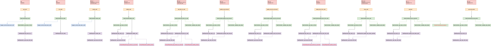

# Test Report

<The goal of this document is to explain how the application was tested, detailing how the test cases were defined and what they cover>

# Contents

- [Test Report](#test-report)
- [Contents](#contents)
- [Dependency graph](#dependency-graph)
- [Integration approach](#integration-approach)
- [Tests](#tests)
- [Coverage](#coverage)
  - [Coverage of FR](#coverage-of-fr)
  - [Coverage white box](#coverage-white-box)

# Dependency graph

# Integration approach

The integration sequence adopted follows a mixed approach:

1. **Unit Testing**: Individual components were tested in isolation using a White Box approach with Simple Decision Coverage:
   - **Mapper Service**: Tested directly without the need for mocks.
   - **Repository**: Tested in isolation by mocking calls to the `ProductRepository` and the underlying database.
   - **Controller**: Tested in isolation by creating stubs (mocks) for functions related to `SaleRepository` and `SystemController`.

2. **Integration Testing**: Focused on specific Controller functions (`create_sale`, `list_sales`, `get_sale`). In this step, calls to the Repository remained mocked, but the interaction with the **Mapper Service** (`sale_dao_to_dto`) was real (no mocks), verifying the correct integration between Controller and Mapper. The technique used remained White Box with Simple Decision Coverage.

3. **API Testing (System)**: The full system was tested at the Route level using a Black Box approach, specifically applying Equivalence Class Partitioning.

# Tests

<in the table below list the test cases defined For each test report the object tested, the test level (API, integration, unit) and the technique used to define the test case (BB/ eq partitioning, BB/ boundary, WB/ statement coverage, etc)> <split the table if needed>

| Test case name | Object(s) tested | Test level | Technique used |
| :------------: | :--------------: | :--------: | :------------: |
| test_mapper_service_sale_dao_to_dto.py | sale_dao_to_dto | Unit | WB / Decision coverage |
| test_repository_add_item_to_sale.py | add_item_to_sale | Unit | WB / Decision coverage |
| test_repository_delete_sale.py | delete_sale | Unit | WB / Decision coverage |
| test_repository_remove_item_from_sale.py | remove_item_from_sale | Unit | WB / Decision coverage |
| test_repository_update_sale_discount.py | update_sale_discount | Unit | WB / Decision coverage |
| test_repository_update_sale_line_discount.py | update_sale_line_discount | Unit | WB / Decision coverage |
| test_repository_update_sale_status_paid.py | update_sale_status_paid | Unit | WB / Decision coverage |
| test_repository_update_sale_status_pending.py | update_sale_status_pending | Unit | WB / Decision coverage |
| test_controller_add_item_to_sale.py | add_item_to_sale | Unit | WB / Decision coverage |
| test_controller_close_sale.py | close_sale | Unit | WB / Decision coverage |
| test_controller_delete_item_from_sale.py | delete_item_from_sale | Unit | WB / Decision coverage |
| test_controller_delete_sale.py | delete_sale | Unit | WB / Decision coverage |
| test_controller_get_sale_points.py | get_sale_points | Unit | WB / Decision coverage |
| test_controller_process_payment.py | process_payment | Unit | WB / Decision coverage |
| test_controller_update_sale_discount.py | update_sale_discount | Unit | WB / Decision coverage |
| test_controller_update_sale_line_discount.py | update_sale_line_discount | Unit | WB / Decision coverage |
| test_controller_create_sale.py | create_sale | Integration | WB / Decision coverage |
| test_controller_get_sale.py | get_sale | Integration | WB / Decision coverage |
| test_controller_list_sales.py | list_sales | Integration | WB / Decision coverage |
| test_route_add_item_to_sale.py | add_item_to_sale | API | BB / Equivalence partitioning |
| test_route_close_sale.py | close_sale | API | BB / Equivalence partitioning |
| test_route_create_sale.py | create_sale | API | BB / Equivalence partitioning |
| test_route_delete_item_from_sale.py | delete_item_from_sale | API | BB / Equivalence partitioning |
| test_route_delete_sale.py | delete_sale | API | BB / Equivalence partitioning |
| test_route_get_sale.py | get_sale | API | BB / Equivalence partitioning |
| test_route_get_sale_points.py | get_sale_points | API | BB / Equivalence partitioning |
| test_route_list_sales.py | list_sales | API | BB / Equivalence partitioning |
| test_route_payment.py | process_payment | API | BB / Equivalence partitioning |
| test_route_update_sale_discount.py | update_sale_discount | API | BB / Equivalence partitioning |
| test_route_update_sale_line_discount.py | update_sale_line_discount | API | BB / Equivalence partitioning |

# Coverage

## Coverage of FR

<Report in the following table the coverage of functional requirements and scenarios(from official requirements) >

| Functional Requirement or scenario | Test(s) |
| :--------------------------------: | :-----: |
|                FR6.1               |   test_mapper_service_sale_dao_to_dto.py, test_route_create_sale.py, test_controller_create_sale.py  |
|                FR6.2               |   test_route_add_item_to_sale.py, test_controller_add_item_to_sale.py, test_repository_add_item_to_sale.py |
|                FR6.3               |   test_route_delete_item_from_sale.py, test_controller_delete_item_from_sale.py, test_repository_remove_item_from_sale.py  |
|                FR6.4               |   test_route_update_sale_discount.py, test_controller_update_sale_discount.py, test_repository_update_sale_discount.py      |
|                FR6.5               |   test_route_update_sale_line_discount.py, test_controller_update_sale_line_discount.py, test_repository_update_sale_line_discount.py      |
|                FR6.6               |   test_route_get_sale_points.py, test_controller_get_sale_points.py      |
|                FR6.10              |   test_route_close_sale.py, test_controller_close_sale.py, test_repository_update_sale_status_pending.py       |
|                FR6.11              |   test_route_delete_sale.py, test_controller_delete_sale.py, test_repository_delete_sale.py      |
|                FR7.1               |   test_route_payment.py, test_controller_process_payment.py, test_repository_update_sale_status_paid.py      |
|                Scenario 6-1        |   test_mapper_service_sale_dao_to_dto.py, test_route_create_sale.py, test_controller_create_sale.py, test_route_add_item_to_sale.py, test_controller_add_item_to_sale.py, test_repository_add_item_to_sale.py, test_route_close_sale.py, test_controller_close_sale.py, test_repository_update_sale_status_pending.py      |
|                Scenario 6-2        |   test_mapper_service_sale_dao_to_dto.py, test_route_create_sale.py, test_controller_create_sale.py, test_route_add_item_to_sale.py, test_controller_add_item_to_sale.py, test_repository_add_item_to_sale.py, test_route_update_sale_line_discount.py, test_controller_update_sale_line_discount.py, test_repository_update_sale_line_discount.py, test_route_close_sale.py, test_controller_close_sale.py, test_repository_update_sale_status_pending.py      |
|                Scenario 6-3        |   test_mapper_service_sale_dao_to_dto.py, test_route_create_sale.py, test_controller_create_sale.py, test_route_add_item_to_sale.py, test_controller_add_item_to_sale.py, test_repository_add_item_to_sale.py, test_route_update_sale_discount.py, test_controller_update_sale_discount.py, test_repository_update_sale_discount.py, test_route_close_sale.py, test_controller_close_sale.py, test_repository_update_sale_status_pending.py      |
|                Scenario 6-4        |   test_mapper_service_sale_dao_to_dto.py, test_route_create_sale.py, test_controller_create_sale.py, test_route_add_item_to_sale.py, test_controller_add_item_to_sale.py, test_repository_add_item_to_sale.py, test_route_close_sale.py, test_controller_close_sale.py, test_repository_update_sale_status_pending.py, test_route_get_sale_points.py, test_controller_get_sale_points.py      |
|                Scenario 6-5        |   test_mapper_service_sale_dao_to_dto.py, test_route_create_sale.py, test_controller_create_sale.py, test_route_add_item_to_sale.py, test_controller_add_item_to_sale.py, test_repository_add_item_to_sale.py, , test_route_close_sale.py, test_controller_close_sale.py, test_repository_update_sale_status_pending.py, test_route_delete_sale.py, test_controller_delete_sale.py, test_repository_delete_sale.py      |
|                Scenario 6-6        |    test_mapper_service_sale_dao_to_dto.py, test_route_create_sale.py, test_controller_create_sale.py, test_route_add_item_to_sale.py, test_controller_add_item_to_sale.py, test_repository_add_item_to_sale.py, test_route_close_sale.py, test_controller_close_sale.py, test_repository_update_sale_status_pending.py      |
|                Scenario 7-4        |   test_route_payment.py, test_controller_process_payment.py, test_repository_update_sale_status_paid.py      |

## Coverage white box

Report here the screenshot of coverage values obtained with PyTest
